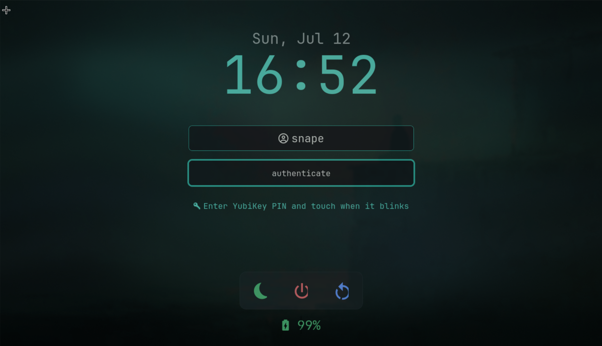

<div align="center">

# Leenium Hyprlock


**A Hyprlock lock screen theme built from the shared Leenium palette.**

Hosted under `github.com/drunkleen/leenium.hyprlock`.



</div>

---

## Color Palette

| Role | Hex | Swatch |
|---|---|---|
| Background | `#0b1113` |  |
| Panel | `#11191c` |  |
| Floating | `#182326` |  |
| Border | `#223033` |  |
| Active Border | `#304144` |  |
| Foreground | `#d8e3e0` |  |
| Soft Text | `#a4b4b2` |  |
| Cyan | `#59d6c5` |  |
| Teal | `#33b8a8` |  |
| Yellow | `#d9c76b` |  |
| Blue | `#5e9bff` |  |
| Emerald | `#4dba7a` |  |
| Red | `#e16f73` |  |

---

## Features

- **Shared palette** - matches the same Leenium colors used across the other repos
- **Dark lock UI** - restrained borders, centered typography, and soft palette surfaces
- **State colors** - battery and action states use the Leenium accent colors
- **Custom backdrop** - uses a rendered Leenium lock background image

---

## Install

Copy the config and helper files into your Hyprlock config directory:

```bash
git clone https://github.com/drunkleen/leenium.hyprlock.git && cd leenium.hyprlock
mkdir -p ~/.config/hypr/hyprlock
cp hyprlock.conf ~/.config/hypr/hyprlock.conf
cp -r hyprlock/* ~/.config/hypr/hyprlock/
```

---

## Use

- `hyprlock.conf` is the main config file.
- `hyprlock/leenium-hyprlock.png` is the lock backdrop.
- `hyprlock/battery-status-hyprlock` renders the battery line.
- `hyprlock/hyprlock-yubikey-hint` renders the YubiKey hint.

---

## Notes

- The clock, battery, and action labels are all mapped to the shared palette.
- The background is intentionally dark to keep the lock screen low-glare.

---

## License

MIT © [Leenium](LICENSE)
